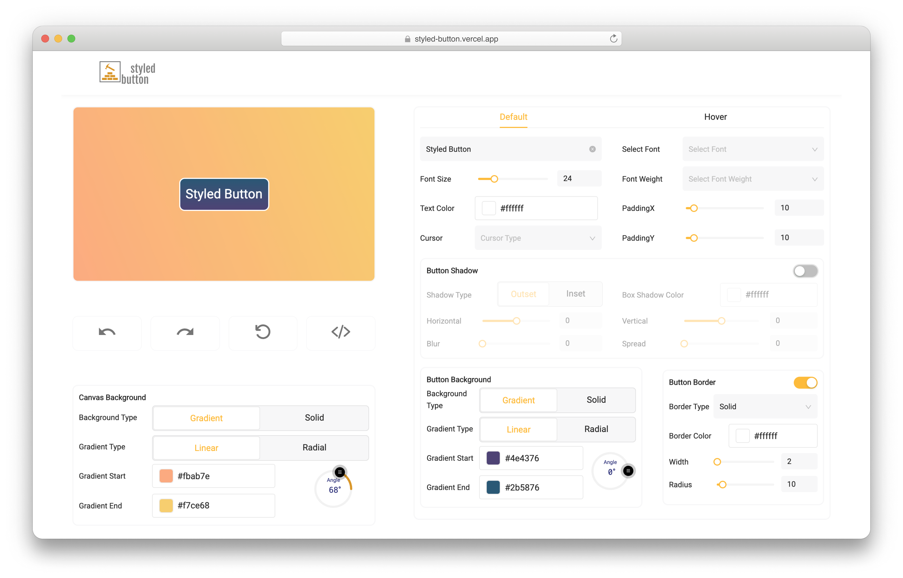

# Styled Button

[](https://styled-button.vercel.app/)

### A live button generator that generates styled-components code in few clicks.

This design tool helps you to design buttons by configuring button properties like font-size, padding, shadow, background-color, border in default as well as hover state.

## Built with

- [Create React App](https://github.com/facebook/create-react-app)
- [Redux Tookit](https://github.com/reduxjs/redux-toolkit)
- [styled-components](https://github.com/styled-components/styled-components)

## Setup the Project

The following steps will get you up and running with Styled Button:

1. Clone the repo (click the <kbd>Code</kbd> button on this
   [this page](https://github.com/SBhanushali/styled-button-factory.git))

2. Clone your locally

```sh
git clone https://github.com/SBhanushali/styled-button-factory.git
cd styled-button-factory
```

3. Setup all the dependencies and packages by running `yarn` or `npm install`. This
   command will install dependencies.
   
## Contributing

Feel to open issues and generate PRs.

## License

Distributed under the MIT License. See `LICENSE` for more information.

## Acknowledgements

- [Redux undo/redo](https://github.com/omnidan/redux-undo)
